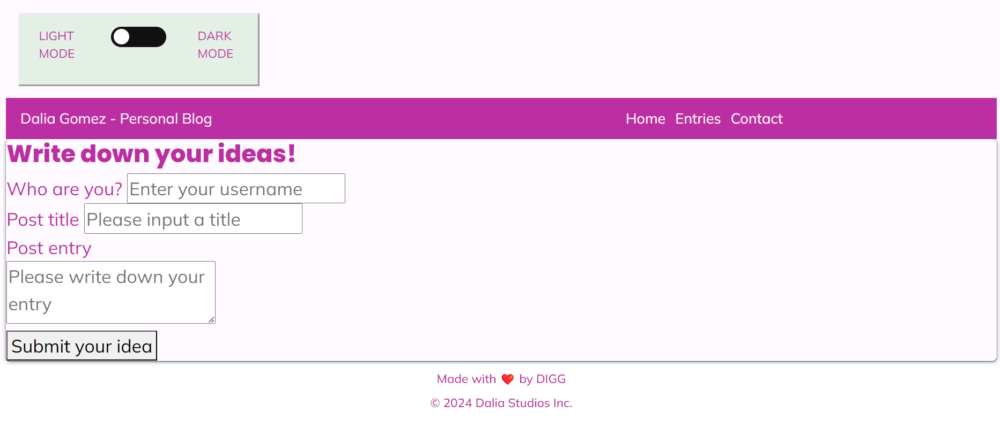
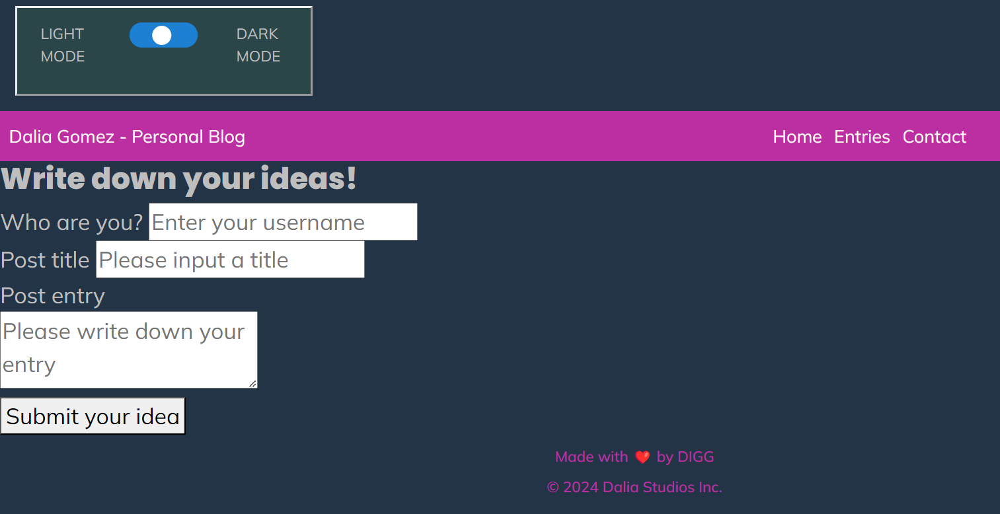
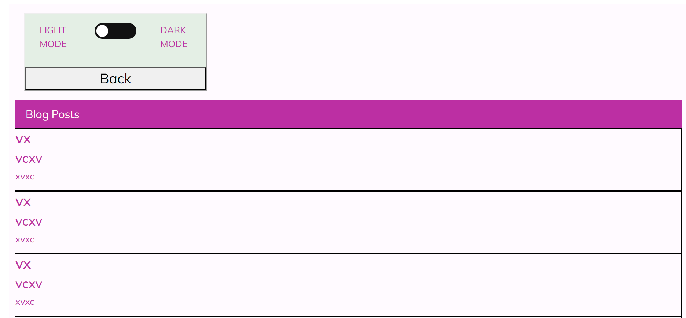
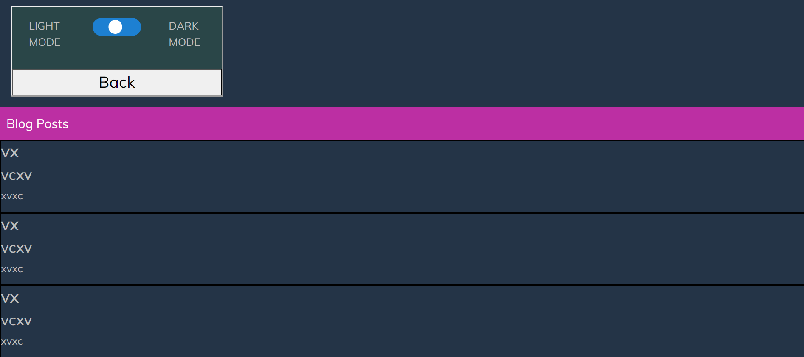

# DIGG-Module4-Challenge-WebAPIs-PersonalBlog
Dalia Gomez - Module 4 Challenge: Web APIs, Personal Blog.

## Description
The purpose of this challenge was to create a personal blog for a marketing student, described as a "two-page website where users will input and view blog posts", to showcase thoughts and experiences. The "DIGG-Module4-Challenge-WebAPIs-PersonalBlog" repository includes two CSS files (style.css and blogStyle.css), two HTML files (index.html and blog.html), two JavaScript files (script.js and blog.js), an images folder, a .gitignore file, a license file and this README file.

## Links
- URL of the GitHub repository that contains the code: https://github.com/dali-gogo/DIGG-Module4-Challenge-WebAPIs-PersonalBlog/
- URL of the deployed application: dali-gogo.github.io/DIGG-Module4-Challenge-WebAPIs-PersonalBlog 

## Usage
After clicking the "Submit your idea" button, the user is taken to a second page (blog.html), where he/she is able to see the blog posts that have been created, including username, post title and post entry. The user has the option to return to the home page (index.html) when clicking on the "Back" button in the blog.html page. In both pages, there is a light/dark mode option, to improve user experience. The homepage will alert the user if he/she hasn't completed one of the required fields (username, post title or post entry), so he/she must fill out all the required fields to proceed to the next page (blog posts page). At the bottom of both pages, there is a link to the developer's portfolio (Dalia Gomez).

## Credits
Modules 4 and 5 from Bootcamp TDM-VIRT-FSF-PT-03-2024-U-LOLC-MTTH were used as a reference to structure the code used in this repository. Special thanks to the instructor, TA and tutors for the support provided to understand Web APIs fundamentals. The page has been designed and structured by Dalia Gomez.

## License
MIT License used for this repository.

## Screenshots

